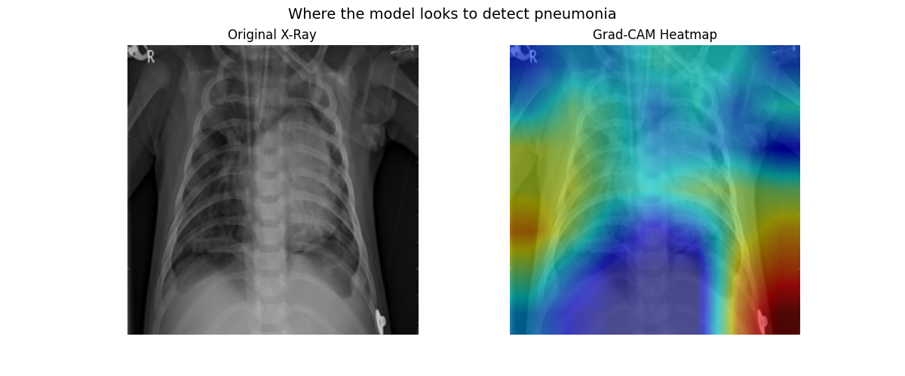

# Chest X-Ray Pneumonia Classifier
> A deep learning model for automated pneumonia detection from chest radiographs, built with ResNet50 and interpretable via Grad-CAM visualization.

---

## Overview

This project implements a binary image classifier to distinguish **pneumonia** from **normal** chest X-rays using transfer learning on a ResNet50 backbone. Built as an independent project during M1 year to explore the intersection of clinical medicine and applied machine learning.

**Clinical motivation:** Pneumonia is one of the most common diagnoses on chest X-ray, yet early or subtle findings are frequently missed. Automated detection tools trained on large datasets can serve as a second-reader system to flag high-risk cases for radiologist review.

---

## Results

| Metric | Value |
|---|---|
| Test Accuracy | 84% |
| AUC-ROC | 0.94 |
| Pneumonia Recall (Sensitivity) | 96% |
| Normal Precision (Specificity proxy) | 90% |

**Key tradeoff:** The model is tuned for high sensitivity (96% pneumonia recall), accepting lower specificity — appropriate for a screening context where missing a true pneumonia case carries greater clinical risk than a false positive.

### Confusion Matrix & ROC Curve
Results saved in `/results/`. The ROC AUC of 0.94 indicates strong discriminative ability across classification thresholds.

---

## Grad-CAM Interpretability

Gradient-weighted Class Activation Mapping (Grad-CAM) was applied to visualize which regions of the X-ray drive the model's predictions.



**Findings:** For this pneumonia case, Grad-CAM activation concentrates in the **lower thorax and subdiaphragmatic region** rather than the lung fields — the model is not localizing to pulmonary consolidation as intended. This is a meaningful limitation: rather than learning intrapulmonary findings (e.g., lobar consolidation, increased opacity), the model appears to be exploiting correlates in the lower chest wall and upper abdomen, likely reflecting the pediatric body habitus dominant in this dataset (prominent liver silhouette, large thymus, or diaphragm position).

This pattern is consistent with **shortcut learning** — the model achieves high AUC by latching onto features that co-vary with pneumonia in the training population but lack clinical interpretability. Plausible shortcuts include subcutaneous soft tissue density, diaphragm curvature, or abdominal organ silhouette, all of which differ systematically between pediatric pneumonia and normal cases independent of pulmonary findings.

This is an acknowledged limitation that tempers the clinical relevance of the reported metrics. Addressing it would require full backbone fine-tuning on radiology-specific data, lung segmentation as a preprocessing step to constrain the model's field of view, or training on a more demographically diverse dataset.

---

## Dataset

**Source:** [Kaggle — Chest X-Ray Images (Pneumonia)](https://www.kaggle.com/datasets/paultimothymooney/chest-xray-pneumonia) by Paul Mooney

The original train and validation splits are merged and re-split 80/20 to increase validation set size (the original val set contains only 16 images).

| Split | Normal | Pneumonia | Total |
|---|---|---|---|
| Train (80% of train+val) | ~1,073 | ~3,100 | ~4,173 |
| Validation (20% of train+val) | ~268 | ~775 | ~1,043 |
| Test (held-out) | 234 | 390 | 624 |

**Class imbalance handling:** The training set is ~74% pneumonia. Weighted random sampling (inverse class frequency) is used during training so the model sees balanced class exposure each epoch, without discarding any data.

---

## Model Architecture

```
ResNet50 (ImageNet pretrained)
└── Classifier head (replaced):
    ├── Linear(2048 → 256)
    ├── ReLU
    ├── Dropout(0.5)
    └── Linear(256 → 2)
```

- **Backbone:** ResNet50 with ImageNet weights; backbone frozen, only the classifier head is trained
- **Optimizer:** Adam (lr=0.001)
- **Loss:** CrossEntropyLoss
- **LR Scheduler:** ReduceLROnPlateau (patience=3, factor=0.1)
- **Early stopping:** patience=5 epochs
- **Augmentation:** Random horizontal flip, rotation (±10°)

---

## Project Structure

```
chest_xray_project/
├── data/
│   └── chest_xray/
│       ├── train/
│       ├── val/
│       └── test/
├── models/
│   └── best_model.pth        ← best validation checkpoint
├── results/
│   ├── confusion_matrix.png
│   ├── roc_curve.png
│   └── gradcam.png
└── notebooks/
    └── chest_xray_classifier.ipynb
```

---

## How to Run

### Prerequisites
```bash
pip install torch torchvision pytorch-grad-cam matplotlib scikit-learn pillow seaborn
```

### Training
Open `notebooks/chest_xray_classifier.ipynb` in Google Colab and run cells sequentially. Mount Google Drive when prompted. Dataset path assumed at:
```
/content/drive/MyDrive/chest_xray_project/data/chest_xray/
```

Kaggle API credentials and GitHub token are read from **Colab Secrets** — never stored in the notebook. Add the following secrets before running:
- `KAGGLE_USERNAME`, `KAGGLE_KEY`
- `GITHUB_TOKEN`, `REPO_URL`, `GIT_NAME`, `GIT_EMAIL`

### Inference + Grad-CAM
The final notebook cells handle model reload, test set evaluation, and Grad-CAM generation without retraining. Set `FORCE_RETRAIN = False` (default) to load the saved checkpoint.

---

## Limitations & Future Work

- **Shortcut learning:** Grad-CAM reveals activation in the subdiaphragmatic region rather than the lung fields, suggesting the model exploits body habitus correlates rather than true pulmonary findings
- **Dataset bias:** Training images are predominantly pediatric; adult pneumonia patterns (e.g., interstitial, atypical) may not generalize well
- **Binary classification only:** Does not distinguish bacterial vs. viral pneumonia, or other pathologies (effusion, atelectasis)
- **Frozen backbone:** Only the classifier head is trained; full fine-tuning on radiology-specific data may improve both performance and interpretability
- **No external validation:** Model has not been tested on out-of-distribution data (different scanners, patient populations)

**Potential next steps:** Full backbone fine-tuning, lung segmentation preprocessing to constrain the model's field of view, multi-class pathology detection (NIH ChestX-ray14 dataset), attention-based architectures (Vision Transformer), prospective clinical validation framework

---

## Clinical Disclaimer

This model is a research/educational project and is **not validated for clinical use**. It should not be used to guide patient care decisions.

---

## Author

M1 Medical Student  
Built independently as a portfolio project  
Tools: Python, PyTorch, Google Colab, pytorch-grad-cam

